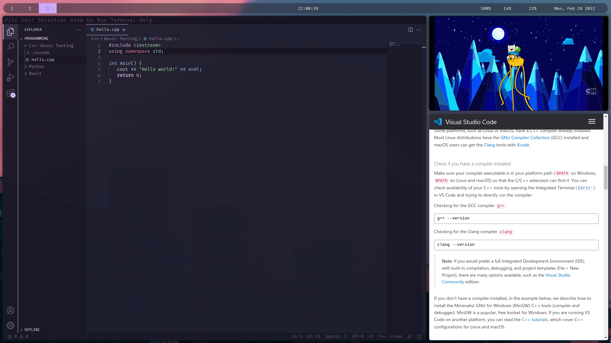

# Basic setup
My go to setup & dependencies for my Arch setup! This is still a work in progress to get everything fine tuned, and most of the config composed of small tweaks to default configs or config parts referenced from the internet.

# Appearance
**GTK-Theme:** Catppuccin  
**Icons:** Candy Icons  
**WM:** i3-gaps  
**Font:** Fira Code  
**Terminal:** Alacritty  

# Dependencies
`i3-gaps alacritty picom rofi nitrogen lightdm`
